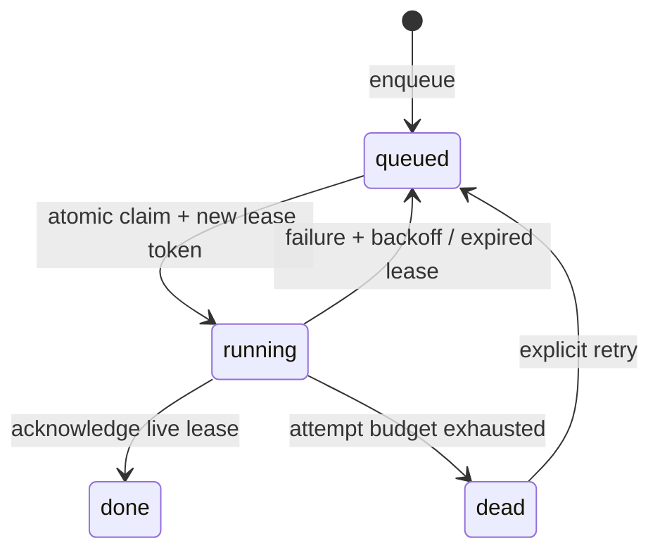

# AnchorQueue

**Durable background jobs. One database. Explicit failure semantics.**

A dependency-free Python job queue for applications running on a single host.
Persist jobs across restarts, coordinate multiple workers, and recover abandoned
work with expiring leases. Built for small services, local automation and learning
how reliable job processing works.

## Try it in 30 seconds

Python 3.11 or newer; no Redis, containers or external service required.

```sh
python -m anchorqueue --db demo.db demo
python -m unittest discover -s tests -v
```

The demo requires a fresh database and prints a processed result with one completed
job. To install the command, run `python -m pip install .`.

## Use it from Python

```python
from anchorqueue import Queue

queue = Queue("jobs.db")
job_id = queue.enqueue("report", {"account": 42}, dedupe_key="report:42:2026-10")
job = queue.claim(lease_seconds=60)
if job is not None:
    try:
        print(job.kind, job.payload)  # replace with your explicit handler
    except Exception as exc:
        queue.fail(job, str(exc))
    else:
        queue.ack(job)
print(queue.stats())
```

Dispatch only known job kinds to explicit handlers. Long-running handlers must call
`heartbeat` before their lease expires. The library does not start threads or run
arbitrary commands for you. See [the worker example](examples/worker.py).

## Guarantees and tradeoffs

| Concern | Behavior |
| --- | --- |
| Persistence | SQLite WAL with synchronous FULL; transactions commit before returning |
| Worker contention | `BEGIN IMMEDIATE` serializes claims across threads and processes |
| Worker crash | The next claim reclaims expired leases; claims consume attempt budget |
| Stale worker | A fresh token per claim rejects late acknowledgement, failure and heartbeat |
| Retries | Capped exponential backoff; exhausted jobs enter `dead` |
| Deduplication | Optional unique key, retained even after completion; first payload wins |
| Scheduling | Higher priority first, FIFO for equal priority, delayed availability |
| Delivery | At least once within the configured attempt budget; handlers must be idempotent |

**Not exactly once.** A process may perform an external side effect and crash before
acknowledging. A replacement worker can then repeat it. Tokens protect queue state,
not external systems. Use the job ID as an idempotency key at the destination.

## CLI

```sh
python -m anchorqueue --db jobs.db enqueue report '{"account":42}' --key report-42
python -m anchorqueue --db jobs.db stats
python -m anchorqueue --db jobs.db inspect JOB_ID
python -m anchorqueue --db jobs.db retry JOB_ID
```

Arguments shown use POSIX shell quoting. In PowerShell, use the Python API if your
version rewrites JSON quotes. CLI output is JSON; errors go to stderr.

## Architecture



[Design decisions and failure model](docs/architecture.md) explain locking,
lease fencing and the limits of crash recovery.

## Validation

The standard-library test suite covers persistence, simultaneous claims in threads
and separate processes, concurrent deduplication, lease expiry, stale tokens,
heartbeats, bounded retries, scheduling and CLI errors. GitHub Actions is configured
for Python 3.11–3.14 on Windows and Linux. Remote CI results depend on running the
workflow after publication.

## Scope

This is an early `0.1.0` library, not a distributed broker. Use a local disk;
network filesystems and multi-host deployments are unsupported. There is no auth,
web dashboard, automatic retention, schema migration framework or production load
benchmark. Completed jobs remain stored. A stopped poller delays lease recovery.
Wall-clock jumps can affect scheduling. Priority traffic can starve lower-priority
jobs. Database access is trusted; payloads must not contain secrets you cannot store
on the host.

## Development

Keep state changes transactional and add behavioral tests for failure scenarios.
Avoid timing-dependent sleeps in tests: the queue accepts an injected clock.
Proposals for retention, metrics and explicit schema migrations are welcome.

MIT · [Orçun Kara](https://okdev.tr)
